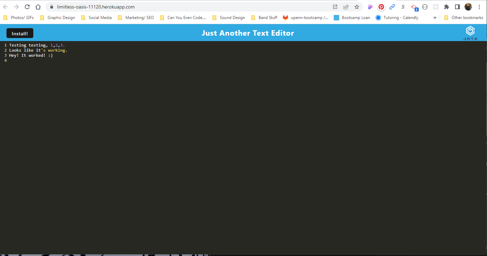

# textual-healing

## Description

Progressive web applications have been on the rise with the birth of all different kinds of technologies. Harnessing the use of service workers, Google's Workbox, browser built-in IndexedDB, and use of Manifests, I've created a text editor that can save your work while you're on the go. Utilize the syntax highlighting. Want to take it out of the browser? Feel free to download it and use it as a standalone app as well!

## Table of Contents (Optional)

If your README is long, add a table of contents to make it easy for users to find what they need.

- [Installation](#installation)
- [Usage](#usage)
- [Technologies](#Technologies)
- [License](#license)

## Installation

Upon cloning down the repository, be sure to install all dependencies (Note there there are <strong>three</strong> package.json - one for the root, one for the client side, and one for the server side) by typing `npm run start:dev` in the terminal. Along with installing all necessary packages and plugins, this should also have webpack build our bundles. From there, you should be able to `npm run start` and open the newly created `index.html` file that is in the `dist` folder to see that application work in your browser. 

## Usage

Check out the deployed application [here](https://limitless-oasis-11120.herokuapp.com/) to try it out. 

You should be able to use this text editor to jot down JavaScript notes or practice algorithms. It even has syntax highlighting! Thanks to the indexedDB database and the service workers behind the scenes, your notes should be stored and persist as you reopen the page. Don't want to leave it in the browser? hit the install button in the right-hand corner of your browser search bar and download this app as a standalone for your desktop or mobile device.

Here's a screenshot of the application in the browser:
    

The installed, standalone application:

## Technologies 

The following tools and plugins were used to create this application:

* HTML/CSS/JavaScript
* Node
* Express 
* Webpack (Module bundling to compress our JavaScript, making it faster)
* Babel (To convert complex JavaScript for backwards compatibility in older browsers)
* idb (For ease of use with the built-in indexedDB)
* HTML WebPack Plugin (Dynamically creating an index.html folder)
* Webpack PWA Manifest (Dynamically create a manifest.json file)

## License

This project has been furnished with an MIT license and parties may obtain a copy of this software for their own use. [Here](https://github.com/git/git-scm.com/blob/main/MIT-LICENSE.txt) are some more details. 
